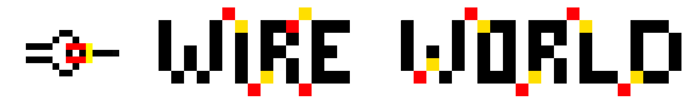

# P2-WireWorld

This repository contains our implementation of the second JIMP2 project - Brian Silverman's WireWorld in Java.

## Authors
* [Kacper Seredyn](https://github.com/scintilla4evr)
* [Hubert Nakielski](https://github.com/nakielsh)