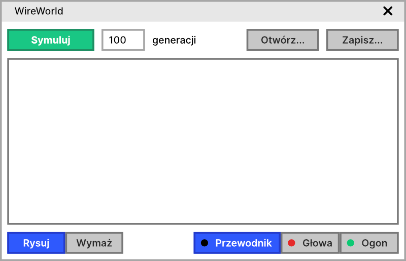

## 1. Opis Ogólny

### 1.1: Nazwa programu
**WireWorld Briana Silvermana**

### 1.2: Poruszany problem
Symulacja i ładowanie planszy WireWorld.

### 1.3: Użytkownik docelowy
mgr Wiktor Łodyga
Użytkownicy uczący się CoMpUtEr ScIeNC, artySĆI™ tworzący sztukę proceduralną

## 2. Opis Funkcjonalności

### 2.1: Jak korzystać z progamu?
Aby uruchomić program należy wczytać bądź narysować planszę. Następnie należy wpisać liczbę generacji. Po wciśnięciu przycisku `Symuluj` symulacja nastąpi.

### 2.2: Uruchomienie programu
Przycisk `Symuluj` startuje program. 

### 2.3: Możliwości programu
- symulacja
- rysowanie dowolnych układów lub wybieranie z listy szablonów
- wczytywanie plików z .life2
- retusz obrazów
- obrupka audio
- generowanie szumu z mikrofonu

## 3. Format danych i struktura plików

### 3.1: Pojęcia i pola formularza (słownik)
- WireWorld
- Symulacja 
- Generacja 
- Bramka logiczna

### 3.2: Struktura katalogów
- `src/` - kod źródłowy
    - `wwld/` - logika WireWorld
    - `gui/` - interfejs graficzny
- `examples/` - przykładowe pliki 
- `out/` - domyślny folder dla plików wyjściowych
- plik wykonywalny w katalogu głównym

### 3.3: Przechowywanie danych w programie
Plansza przechowywana będzie w formie dwuwymiarowej tablicy wartości z enumeracji WireWorldCell (blank, cable, head, tail).

### 3.4: Dane wejściowe
Pliki przyjmowane przez program będą miały strukturę:

|Element|Typ danych|
|-|-|
|Identyfikator "WWLD"|`char[4]`|
|Szerokość|`int`|
|Wysokość|`int`|
|Komórki|`char[]`|

Przykładowe pliki wejściowe będą umieszczone w folderze `examples/`.

### 3.5: Dane wyjściowe
Pliki wyjściowe tworzone przez program będą miały taką samą postać, co pliki wejściowe. Domyślnym folderem docelowym będzie `out/`, jednak użytkownik będzie mógł je zapisać w dowolnej lokalizacji na dysku.

## 4. Scenariusz Działania Programu

### 4.1: Scenariusz ogólny
- otrzymanie danych wejściowych z pliku bądź wprowadzonych przez użytkownika
- wczytanie liczby generacji
- generacja i wyświetlenie nowych danych
- zapis kolejnych generacji do folderu wyjściowego
- 

### 4.2: Scenariusz szczegółowy
- Program otrzymuje dane wejściowe wprowadzone bądź narysowane przez użytkownika. W przypadku nieotrzymania danych wejściowych, program ładuje przykładowy plik z folderu `examples/`.
- Program wczytuje liczbę generacji wprowadzoną prze użytkownika. W przypadku braku podanej liczby, przyjmuje liczb generacji za 100.
- Generacja i wyświetlenie nowych danych.
- Zapis kolejnych generacji docelowo do folderu `out/` lub w dowolnej lokalizacji na dysku wybranej przez użytkownika. 

### 4.3: Ekrany działania programu
Program będzie komunikował się z użytkownikiem w formie graficznej:

Interfejs jest podzielony na 3 główne części:

1. Pasek danych - otwieranie i zapisywanie plików, uruchamianie symulacji
2. Plansza - wyświetlanie obecnego stanu automatu, edycja stanu przez użytkownika
3. Pasek rysowania - narzędzia rysowania na planszy, wybór typów komórek

## 5. Testowanie

### 5.1: Ogólny przebieg testowania
Do przetestowania kodu użyjemy narzędzia JUnit, a GUI przetestujemy ręcznie podczas tworzenia aplikacji.